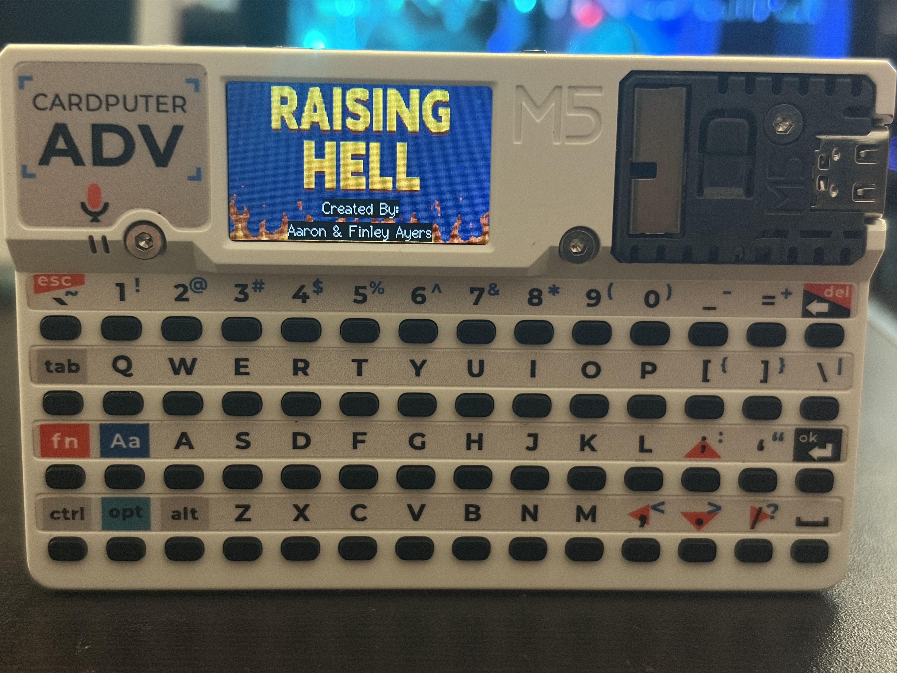
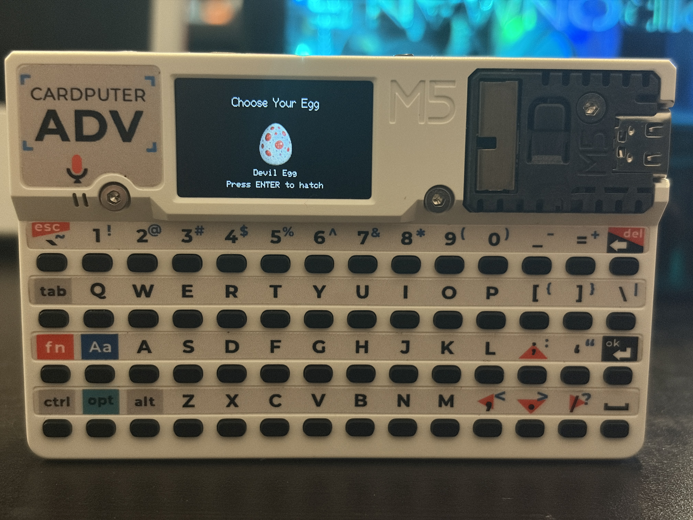
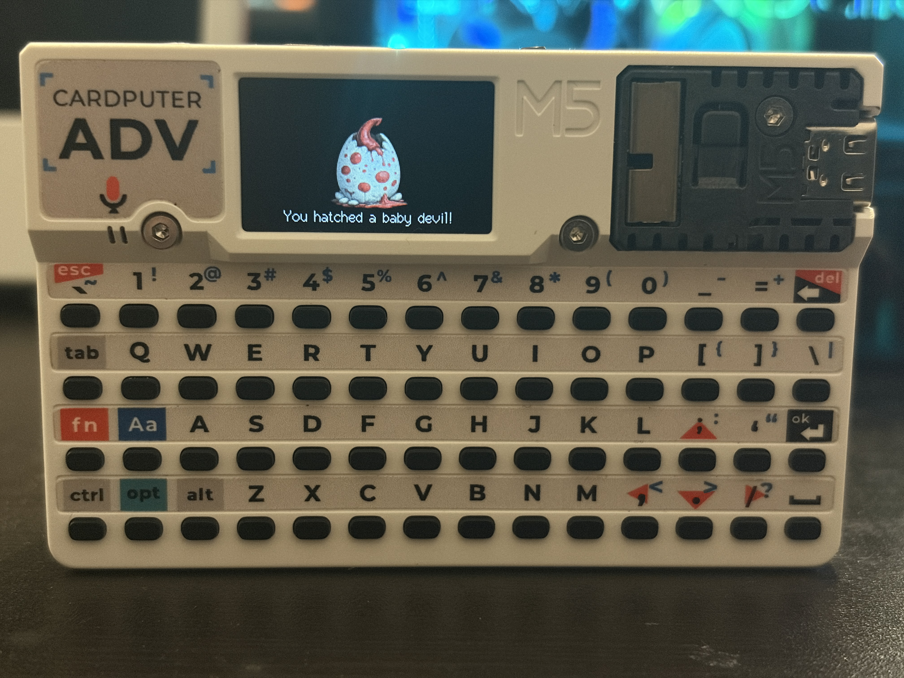
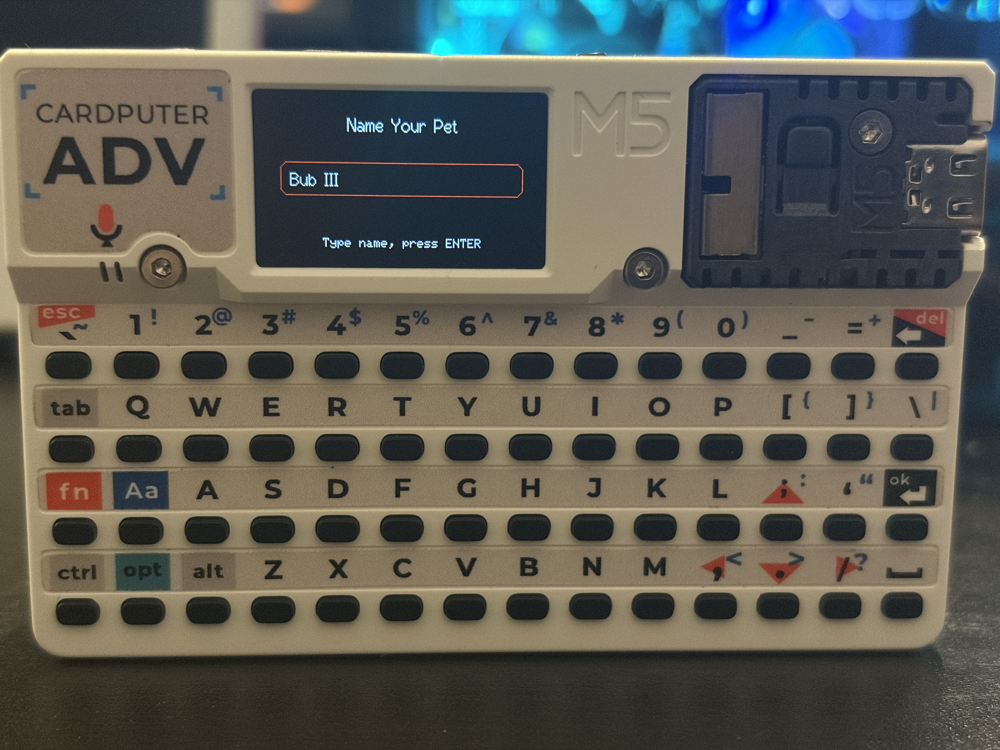
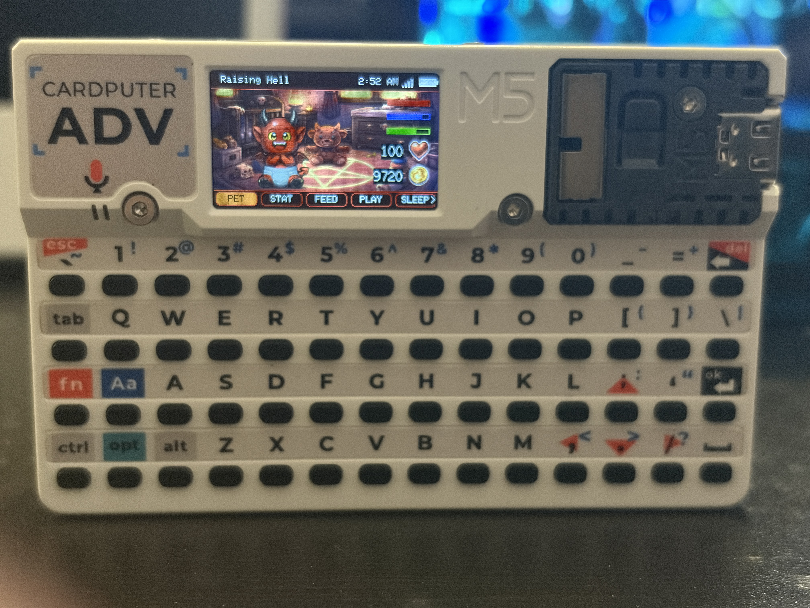
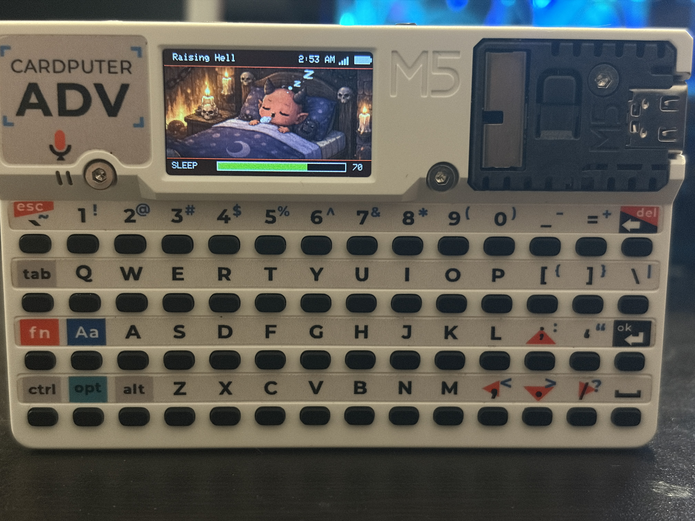
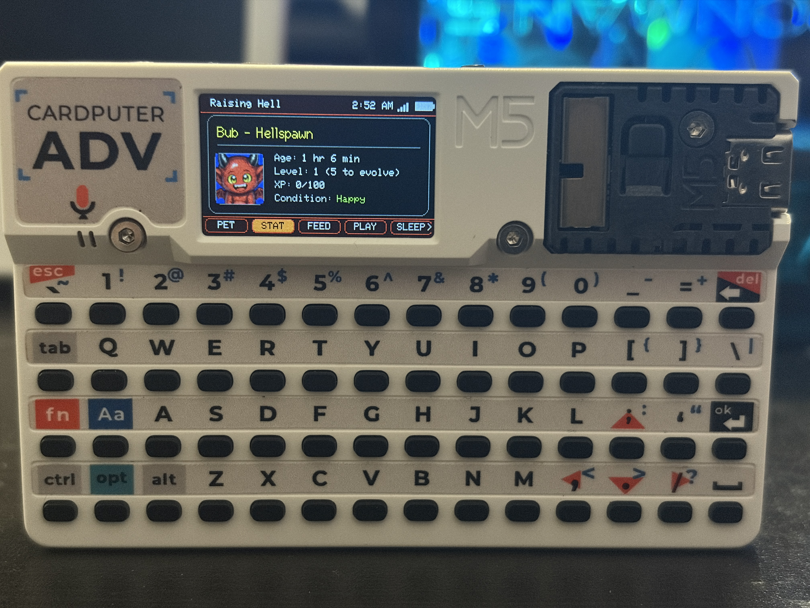
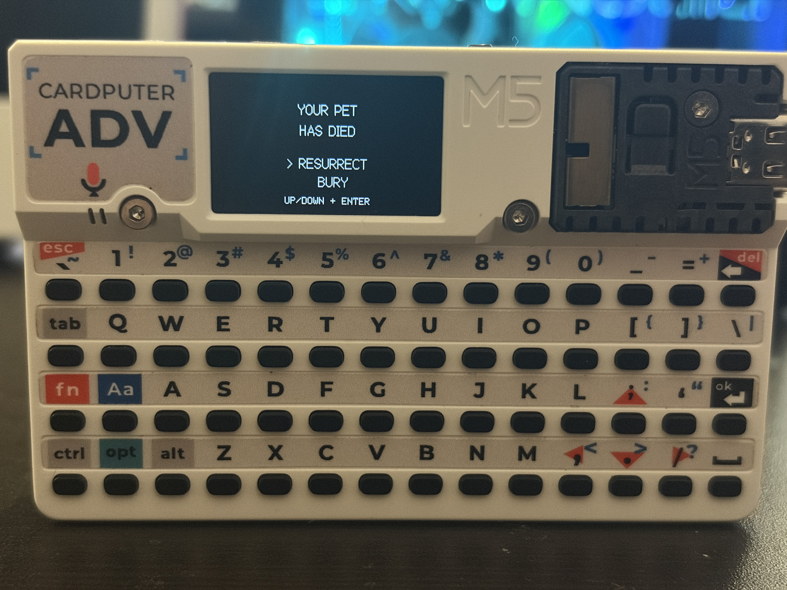
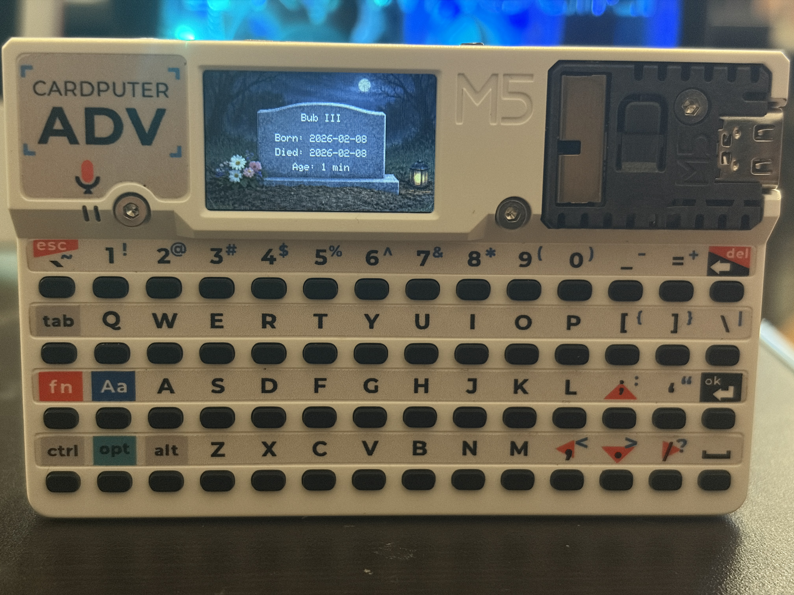

# Raising Hell — Cardputer ADV Edition

A Tamagotchi-style virtual pet game for the M5Stack Cardputer ADV (ESP32).

Raise your infernal companion through multiple life stages, feed it, play mini-games, manage sleep cycles, survive decay, and maybe… resurrect what should not be resurrected.

------------------------------------------------------------
Hardware Target
------------------------------------------------------------

- M5Stack Cardputer ADV
- ESP32 (240 MHz)
- SD card (required for assets)

------------------------------------------------------------
Arduino IDE Settings
------------------------------------------------------------

Recommended configuration:

Board: M5Cardputer
Flash Mode: QIO 80MHz
Flash Size: 4MB (32Mb)
Partition Scheme: Huge APP (3MB No OTA / 1MB SPIFFS)
CPU Frequency: 240MHz (WiFi)
Upload Speed: 921600

------------------------------------------------------------
Project Structure
------------------------------------------------------------

raising_hell_cpADV.ino
src/        (all .cpp and .h files)
assets/     (SD card asset pack)

------------------------------------------------------------
SD Card Setup
------------------------------------------------------------

Copy the contents of the "assets" directory to the root of your SD card.

Expected structure example:

/raising_hell/
    /graphics/
    /pet/
    /anim/
    ...

The game will not function correctly without the SD assets present.

------------------------------------------------------------
Controls
------------------------------------------------------------

Arrow Keys  - Navigate
Enter       - Confirm
Esc         - Back
Hold GO     - Power Menu

(Some mini-games may use alternate input behavior.)

------------------------------------------------------------
Development Direction
------------------------------------------------------------

This project is under active architectural cleanup and refactor toward:

- Modular state architecture
- Strict include hygiene
- Removal of legacy globals
- Separation of platform and gameplay logic
- Open-source readiness

------------------------------------------------------------
Building From Source
------------------------------------------------------------

1. Clone the repository.
2. Copy the assets folder contents to an SD card.
3. Open raising_hell_cpADV.ino in the Arduino IDE.
4. Select the board settings listed above.
5. Compile and upload.

------------------------------------------------------------
Known Limitations
------------------------------------------------------------

- Requires SD card
- Designed specifically for Cardputer ADV hardware
- Not optimized for alternate ESP32 boards

------------------------------------------------------------
License
------------------------------------------------------------

Code is licensed under the MIT License.
See the LICENSE file for details.

Assets licensing is described in ASSETS_LICENSE.md.

------------------------------------------------------------
Author
------------------------------------------------------------

Aaron Ayers

If you build this, fork it, improve it, or port it — I’d love to see it.

------------------------------------------------------------
Screenshots
------------------------------------------------------------

